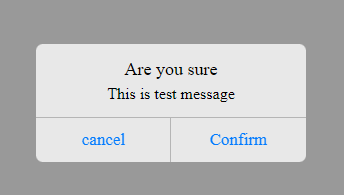
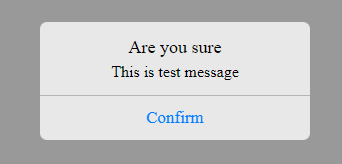

# Simple IOS style alert box
A simple modal dialog reusable component, using only Vanilla JavaScript. No frameworks or external libraries. The modal returns a promise which will give the option that the user chose. ***True*** if the user accepted, ***false*** if the user clicked cancel and ***null*** if the user closed the modal window.

The modal constructor accept one parameter as an object: the modal window title text, message, confirmText, cancelText, showCancelButton, vibrate and sound. Default values are used if the parameters are not provided.

***Since this component uses modern JavaScript, it should be compiled using Babel before deploying for older browsers.***
## Screenshot

### With ```showCancelButton = false```

## Installation
### With NPM

[vanillajs-components](https://www.npmjs.com/package/vanillajs-components)
```bash
npm install vanillajs-components
```

```javascript
//css
import '~vanillajs-components/dist/vanillajs-components.min.css'

// javascript
import {confirm} from 'vanillajs-components';

```
### Without NPM

[comment]: <> (## <a target="_blank" href="https://github.com/EinsCMS/eins-modal/archive/refs/heads/master.zip">Download</a>)


```html
<head>
  <!-- In Head Tag -->
  <link rel="stylesheet" href="/path/to/dist/vanillajs-components.min.css">
</head>
<body>
  <!-- End Of Body Tag -->
  <script src="/path/to/dist/bundle.iife.js"></script>
</body>
```
### Then in Script
Declare a function that will be called by the button, to display confirm modal.

```javascript
<script>
    GR.confirm({title: 'Are you sure', message: 'This is test message', confirmText: 'Confirm', cancelText: 'cancel', showCancelButton: true, vibrate: true, playSound: true})
</script>
```
## Parameters
| Name      | Type | Description|
| :---        |    :----:   | :--- |
| Object        | Object      | This is the object with default values ```{title = "",message = "All Done!", confirmText = "Ok", cancelText = "Cancel", showCancelButton = true, vibrate = true, sound = ''}```  |

## Default params in JSON format
```json
{
  title: 'Are you sure',
  message: 'This is test message',
  confirmText: 'Confirm',
  cancelText: 'cancel',
  showCancelButton: true,
  vibrate: true,
  sound: ''
}
```
## License
[MIT](https://choosealicense.com/licenses/mit/)
