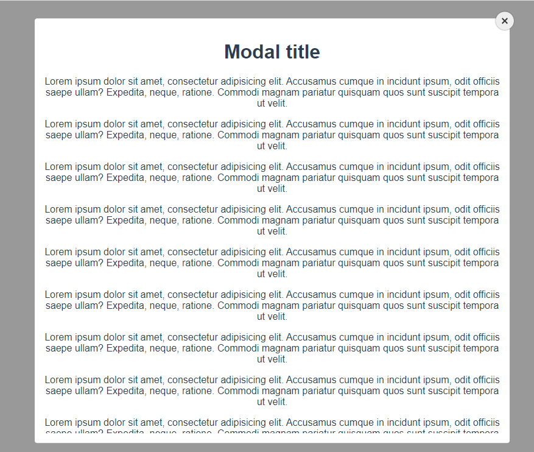

# Modal Overlay
A light and clean modal overlay reusable component, using only Vanilla JavaScript. No frameworks or external libraries.

The Modal overlay constructor accepts only two parameters: Target Element and Close on Escape.

***Since this component uses modern JavaScript, it should be compiled using Babel before deploying for older browsers.***
## Screenshot

## Installation
### With NPM

[vanillajs-components](https://www.npmjs.com/package/vanillajs-components)
```bash
npm install vanillajs-components
```

```javascript
//css
import '~vanillajs-components/dist/vanillajs-components.min.css'

// javascript
import { overlay } from 'vanillajs-components';

```
### Without NPM

## <a target="_blank" href="https://github.com/grim-reapper/vanillajs-components/archive/refs/heads/main.zip">Download</a>


```html
<head>
  <!-- In Head Tag -->
  <link rel="stylesheet" href="/path/to/dist/vanillajs-components.min.css">
    // OR use cdn path
    <link rel="stylesheet" href="https://unpkg.com/vanillajs-components@1.0.1/dist/vanillajs-components.min.css">
</head>
<body>
  <!-- include modal overlay html -->
  <div class="gw-overlay-box" data-gw-overlay="overlay-box"></div>
  <div class="gw-overlay-wrapper" id="gw-overlay" style="display: none">
      <div class="gw-overlay-inner">
          <div class="gw-close-circle-icon gw-close-icon" data-gw-close="gw-close"></div>
          <div class="gw-overlay-content">
              <h1>Overlay Title</h1>
              <p>Lorem ipsum dolor sit amet, consectetur adipisicing elit. Dignissimos dolor, fugit ipsam iusto modi pariatur possimus similique sunt tempore voluptatem? Cum dicta exercitationem id illum modi nisi quos sunt tempore.</p>
          </div>
      </div>
  </div>
  <!-- End Of Body Tag -->
  <script src="/path/to/dist/bundle.iife.js"></script>
  // or use cdn path
  <script src="https://unpkg.com/vanillajs-components@1.0.1/dist/bundle.iife.js"></script>
</body>
```
### Then in Script
Declare a function that will be called by the button, to display the Modal Overlay.

```javascript
<script>
    // provide the target Element ID OR class to overlay function e.g #my-modal or .my-modal
    GR.overlay('#gw-overlay')
</script>
```
***Note:*** You can customize modal overlay HTML completely from the ground, but you have to prove ***Two*** special attributes to close Modal overlay which are <span style="color: red">'data-gw-overlay'</span> which should be added to background overlay, it's value could be anything, and second is <span style="color: red">'data-gw-close'</span> should be added to close button. You can see these two attributes are used in above code example.

## Parameters
| Name      | Type | Description|
| :---        |    :----:   | :--- |
| target        | String      | HTML element ID OR CLASS of modal overlay e.g '#gw-overlay'|
| escape   | Boolean       | Should close modal on Escape key press, Set false if don't want to close on escape, Default value is True

## License
[MIT](https://choosealicense.com/licenses/mit/)
