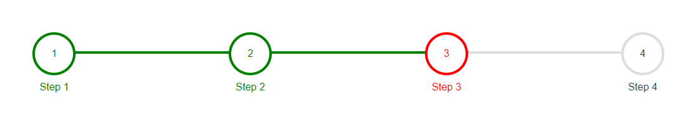

# Steps Progress
A steps reusable component, using only Vanilla JavaScript. No frameworks or external libraries. This component is totally customizable, just write your own code and pass required params to function, and you are done.

Steps constructor accept one parameter as an object. Default values are used if the parameters are not provided.

***Since this component uses modern JavaScript, it should be compiled using Babel before deploying for older browsers.***
## Screenshot

## Installation
### With NPM

[vanillajs-components](https://www.npmjs.com/package/vanillajs-components)
```bash
npm install vanillajs-components
```

```javascript
// javascript
import {steps} from 'vanillajs-components';

```
### Without NPM

## <a target="_blank" href="https://github.com/grim-reapper/vanillajs-components/archive/refs/heads/main.zip">Download</a>


```html
<body>
  <!-- End Of Body Tag -->
  <script src="/path/to/dist/bundle.iife.js"></script>
  // or use cdn path
  <script src="https://unpkg.com/vanillajs-components@1.0.1/dist/bundle.iife.js"></script>
</body>
```
### Then in Script
Declare a function that will be called by the button, to display confirm modal.

```javascript
<script>
    GR.steps({
        container: '.gw-progress-tracker',
        step: '.gw-progress-step',
        activeClass: 'is-active',
        completedClass: 'is-complete',
    })
</script>
```
### Options

| Option         | Default value   |
| -------------- | --------------- |
| container      | '.gw-progress-tracker' |
| step         | '.gw-progress-step' |
| activeClass | 'is-active' |
| completedClass | 'is-complete' |

## Default params in JSON format
```json
{
  container: '.gw-progress-tracker',
  step: '.gw-progress-step',
  activeClass: 'is-active',
  completedClass: 'is-complete',
}
```

## Events
There are two type of global events fired on action performing on tab.

| Event         | Description   |
| -------------- | --------------- |
| before.step.change      | Fired before step change |
| after.step.change         | Fired after step changed |

## Event Listening
To listen fired events
```javascript
document.addEventListener('before.step.change', function(){})
document.addEventListener('after.step.change', function(){})
```

## License
[MIT](https://choosealicense.com/licenses/mit/)
