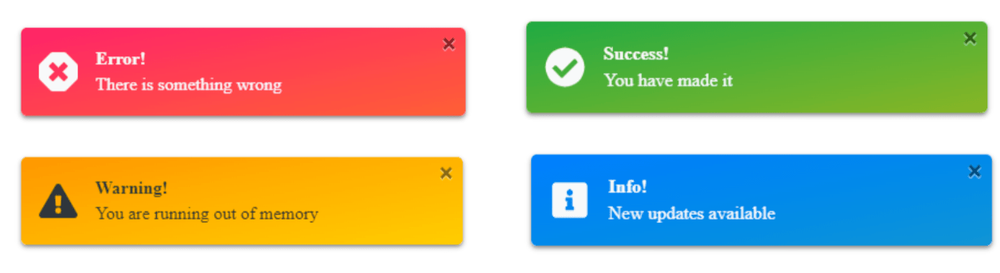

# Simple toaster
A simple toaster reusable component, using only Vanilla JavaScript. No frameworks or external libraries.

The toaster constructor accepts five parameters: the toaster type title message autoClose and closeAfter.

***Since this component uses modern JavaScript, it should be compiled using Babel before deploying for older browsers.***
## Screenshot

## Installation
### With NPM

[vanillajs-components](https://www.npmjs.com/package/vanillajs-components)
```bash
npm install vanillajs-components
```

```javascript
//css
import '~vanillajs-components/dist/vanillajs-components.min.css'

// javascript
import { toast } from 'vanillajs-components';

```
### Without NPM

## <a target="_blank" href="https://github.com/grim-reapper/vanillajs-components/archive/refs/heads/main.zip">Download</a>


```html
<head>
  <!-- In Head Tag -->
  <link rel="stylesheet" href="/path/to/dist/vanillajs-components.min.css">
</head>
<body>
  <!-- End Of Body Tag -->
  <script src="/path/to/dist/bundle.iife.js"></script>
</body>
```
### Then in Script
Declare a function that will be called by the button, to display the toaster.

```javascript
<script>
    GR.toast('error', 'Message text', 'Title', true, 5)
</script>
```
## Parameters
| Name      | Type | Description|
| :---        |    :----:   | :--- |
| type        | String      | Setting toaster type, there are four toaster types which are <span style="color:red">***'error'***</span>, <span style="color:#1d93d2">***'info'***</span>, <span style="color:green">***'success'***</span>, <span style="color:yellow">***'warning'***</span>   |
| message   | String        | Message to be shown      |
| title   | String        | Toaster title, if not specified or empty it won't be display      |
| autoClose   | Boolean        | Set false if do not want to auto close, Default value is True      |
| closeAfter   | Number        | Time in seconds after the toaster will be closed, Default is 5 seconds    |
| sound   | Audio file        | path to audio file to play sound, default is empty    |

## License
[MIT](https://choosealicense.com/licenses/mit/)
